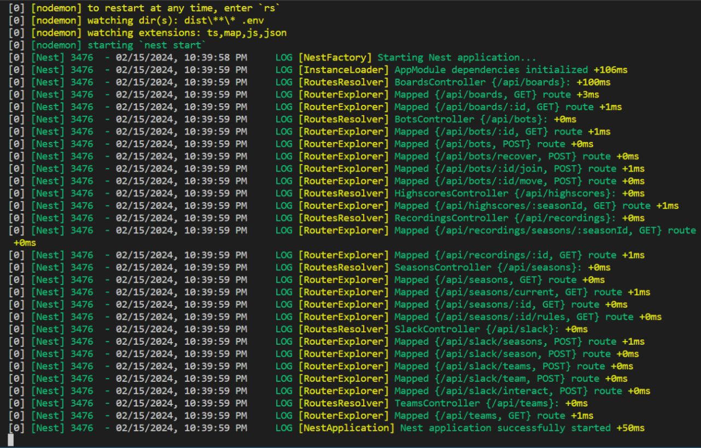
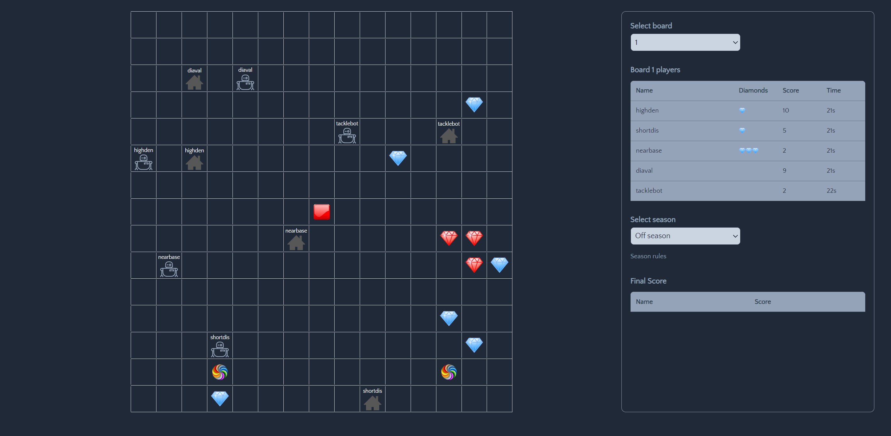
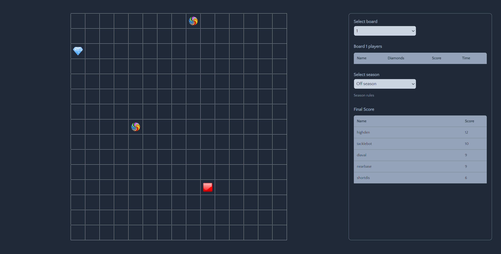

<h1 align="center"> Tugas Besar 1 IF2211 Strategi Algoritma</h1>
<h1 align="center">  Pemanfaatan Algoritma Greedy dalam Pembuatan Bot Permainan Diamonds </h1>

## Identitas Pengembang Program

### **Kelompok 55: Holder RNDR**

|   NIM    |          Nama           |
| :------: | :---------------------: |
| 13522021 |         Filbert         |
| 13522055 |         Benardo         |
| 13522113 | William Glory Henderson |


## Deskripsi Program

Diamonds merupakan suatu programming challenge yang mempertandingkan bot yang anda buat dengan bot dari para pemain lainnya. Setiap pemain akan memiliki sebuah bot dimana tujuan dari bot ini adalah mengumpulkan diamond sebanyak-banyaknya. Cara mengumpulkan diamond tersebut tidak akan sesederhana itu, tentunya akan terdapat berbagai rintangan yang akan membuat permainan ini menjadi lebih seru dan kompleks. Untuk memenangkan pertandingan, setiap pemain harus mengimplementasikan strategi tertentu pada masing-masing bot-nya. Terdapat fitur teleport untuk berpindah tempat dan red button untuk melakukan reset pada diamond serta fitur tackle untuk mengambil seluruh diamond yang dimiliki bot lawan dengan menabrak bot tersebut.

Repositori ini berisi implementasi algoritma **_Greedy by Nearest Base_**  dalam pembuatan bot permainan diamonds. **_Greedy by Nearest Base_** adalah strategi greedy yang mengutamakan pengambilan diamond yang berada di dekat base terlebih dahulu. Kemudian, bot ini juga mengimplementasikan strategi tambahan yaitu **_Greedy by Highest Density_** juga dimana bot akan mencari diamond di area dengan kepadatan tertinggi jika tidak ada diamond di dekat base. Lalu, ada juga beberapa strategi yang diimplementasikan selain strategi utama yang kita pilih (**_Greedy by Nearest Base_**) yaitu seperti **_Greedy by Highest Density_**, **_Greedy by Point Diamond_**, **_Greedy by Shortest Distance_**, dan **_Greedy by Tackle**.

## Requirements Program

1. **Game Engine**

   Requirement yang harus di-install:

   - Node.js (https://nodejs.org/en)
   - Docker desktop (https://www.docker.com/products/docker-desktop/)
   - Yarn

     ```bash
     npm install --global yarn
     ```

2. **Bot Starter Pack**

   Requirement yang harus di-install

   - Python (https://www.python.org/downloads/)

## Set Up dan Build Program

1. Jalankan game engine dengan cara mengunduh starter pack game engine dalam bentuk file .zip yang terdapat pada tautan berikut https://github.com/haziqam/tubes1-IF2211-game-engine/releases/tag/v1.1.0

   a. Setelah melakukan instalasi, lakukan ekstraksi file .zip tersebut lalu masuk ke root folder dari hasil ekstraksi file tersebut kemudian jalankan terminal

   b. Jalankan perintah berikut pada terminal untuk masuk ke root directory dari game engine

   ```bash
   cd tubes1-IF2110-game-engine-1.1.0
   ```

   c. Lakukan instalasi dependencies dengan menggunakan yarn.

   ```bash
   yarn
   ```

   d. Lakukan setup environment variable dengan menjalankan script berikut untuk OS Windows

   ```bash
   ./scripts/copy-env.bat
   ```

   Untuk Linux / (possibly) macOS

   ```bash
   chmod +x ./scripts/copy-env.sh
   ./scripts/copy-env.sh
   ```

   e. Lakukan setup local database dengan membuka aplikasi docker desktop terlebih dahulu kemudian jalankan perintah berikut di terminal

   ```bash
   docker compose up -d database
   ```

   f. Kemudian jalankan script berikut. Untuk Windows

   ```bash
   ./scripts/setup-db-prisma.bat
   ```

   Untuk Linux / (possibly) macOS

   ```bash
   chmod +x ./scripts/setup-db-prisma.sh
   ./scripts/setup-db-prisma.sh
   ```

   g. Jalankan perintah berikut untuk melakukan build frontend dari game-engine

   ```bash
   npm run build
   ```

   h. Jalankan perintah berikut untuk memulai game-engine

   ```bash
   npm run start
   ```

   i. Jika berhasil, tampilan terminal akan terlihat seperti gambar di bawah ini.
   

2. Jalankan bot starter pack dengan cara mengunduh kit dengan ekstensi .zip yang terdapat pada tautan berikut

   https://github.com/haziqam/tubes1-IF2211-bot-starter-pack/releases/tag/v1.0.1

   a. Lakukan ekstraksi file zip tersebut, kemudian masuk ke folder hasil ekstrak tersebut dan buka terminal
   b. Jalankan perintah berikut untuk masuk ke root directory dari project

   ```bash
   cd tubes1-IF2110-bot-starter-pack-1.0.1
   ```

   c. Jalankan perintah berikut untuk menginstall dependencies dengan menggunakan pip

   ```bash
   pip install -r requirements.txt
   ```

   d. Jalankan program dengan cara menjalankan perintah berikuts.

   ```bash
   python main.py --logic NearestBase --email=your_email@example.com --name=your_name --password=your_password --team etimo
   ```

   e. Anda juga bisa menjalankan satu bot saja atau beberapa bot menggunakan .bat atau .sh script.
   Untuk windows

   ```
   ./run-bots.bat
   ```

   Untuk Linux / (possibly) macOS

   ```
   ./run-bots.sh
   ```


## Dokumentasi Program


